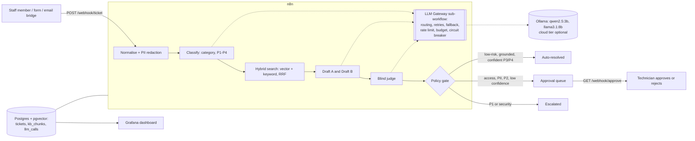

# IT Ops Lab: AI service-desk copilot and small-office homelab

A self-hosted lab that shows how a small IT team can answer routine tickets faster **without letting AI make risky decisions**.
Tickets come in through a webhook, an n8n pipeline triages them, finds the right knowledge base article with hybrid search,
writes two candidate replies with two different local models, has a third call judge them, and then a rule-based policy gate
decides whether the reply can go out automatically or must wait for a technician. Every model call goes through one gateway
that handles routing, retries, fallback, rate limits, a cloud budget and a circuit breaker, and logs cost and latency to Postgres
for a Grafana dashboard.

Everything runs locally on Docker and Ollama. By default (`CLOUD_TIER=off`) no ticket data leaves the machine. If the optional
cloud tier is switched on, only the redacted ticket text and the retrieved KB excerpts are sent, and only for the judging step.

**For hiring managers:** this repo is about service desk judgement more than AI. Start with *Why the gate is rule-based* below
(two real failures I caught in testing and how I fixed them), the KB articles in `kb/`, and the SLA and escalation policy in
`kb/service-desk-policy.md`.

Homelab evidence: [runbook](docs/homelab-runbook.md), [VPN connects but shares fail](docs/cases/01-vpn-shares.md),
[Finance starter access denied](docs/cases/02-finance-starter.md), and [office-wide printing failure](docs/cases/03-office-printing.md).
All three are worked lab simulations with captured diagnostics; [verification transcripts](docs/evidence/) include real AD lockout/unlock tasks.


## What it demonstrates

| Area | In this repo |
|---|---|
| Service desk practice | P1–P4 priorities and SLA targets, escalation rules, approval queue, SLA breach monitor, end-of-day digest (`kb/service-desk-policy.md`) |
| Knowledge management | 8 user-facing KB articles (VPN, file shares, printing, MFA, Wi-Fi, email, onboarding/offboarding) |
| Automation (n8n) | 6 workflows: gateway sub-workflow, ticket intake, approval link, SLA monitor, scheduled and on-demand digests |
| RAG with hybrid search | pgvector (768-d `nomic-embed-text`) + Postgres full-text search merged with Reciprocal Rank Fusion in SQL (`db/init.sql`) |
| LLM gateway | per-task model routing, retries, fallback chain, per-model rate limit, daily cloud budget ("cost autopilot"), circuit breaker, per-attempt telemetry |
| Output arbitration | two drafts from different models, blind judge, plus deterministic checks (citations must match retrieved sections, both drafts must cite the same article) |
| Risk controls | PII detection and redaction before any model sees the text, security and access requests always go to a human |
| Observability | Grafana dashboard provisioned as code: outcomes, fallback rate, latency by model, gateway events, approval queue |
| Testing | `tests/run_demo.py` is a smoke test: 6 realistic tickets, each checked against its expected queue (6/6 in `docs/demo-run.txt`). It is not a full evaluation |

## Architecture



### Why the gate is rule-based

Models are good at drafting and bad at knowing when they are wrong. In the first test run the judge rated a reply as fully
supported even though it told a user with a VPN problem to "raise a P1 ticket" (advice from the lost-device section). So the
final decision is made by code that mirrors the written policy, not by a model:

- P1 and security tickets are escalated, P2 always needs a person.
- Any access or permission change needs approval. A regex backstop catches these even when the model labels them as something else (this was a real miss in testing).
- Tickets with personal or sensitive data are redacted and held.
- A reply is sent automatically (status `auto_resolved` means "reply sent", not "fixed") only if the judge says it is grounded, confidence is at least 0.8, it cites a section that was actually retrieved, and both independent drafts relied on the same article.

### Gateway behaviour you can see in the dashboard

With `CLOUD_TIER=on` (as in the screenshot), the judge's first choice is a cloud model. On a free plan it returns HTTP 402, so the gateway records the failure and falls back
to `llama3.1:8b`. After three failures in ten minutes the circuit opens and the cloud model is skipped without a network call.
Once the daily cloud budget is spent it is skipped too. Local models cost $0, and cloud prices in `model_prices` are illustrative.

## Run it

Prerequisites: Docker Desktop, [Ollama](https://ollama.com) with `nomic-embed-text`, `qwen2.5:3b` and `llama3.1:8b` pulled, Python 3.10+.

```bash
cp .env.example .env            # fill in passwords
docker compose up -d            # postgres :55432, n8n :5678, grafana :13000
python scripts/ingest_kb.py     # chunk, embed and load the KB
python scripts/build_workflows.py
docker compose exec n8n n8n import:workflow --separate --input=/import/workflows
# publish the workflows in the n8n UI (or n8n publish:workflow --id=...), then:
python tests/run_demo.py
```

Try a ticket yourself:

```bash
curl -X POST localhost:5678/webhook/ticket -H "Content-Type: application/json" \
  -d '{"name":"Sam","subject":"Printer offline","body":"My print job is stuck and the printer says offline"}'
```

Approve a held reply: `GET http://localhost:5678/webhook/approve?id=<ticket>&action=approve&by=<name>&token=<APPROVAL_TOKEN>`.
Requests without the token are rejected. The shared token stands in for SSO in this lab, and the approver name is self-reported, so a real deployment would take identity from SSO and keep an audit log.
Dashboard: http://localhost:13000 (anonymous read-only view is enabled).

## Homelab profile

`docker compose --profile homelab up -d` adds the small-office services the knowledge base talks about: a WireGuard VPN
(wg-easy), a Samba file server with Public, Finance and Scans shares and per-user access, a CUPS print server
(Office-Laser, Office-PDF) and Uptime Kuma monitoring. See `docs/homelab-runbook.md`.

## Layout

```
db/init.sql                 schema, hybrid search function, KPI view
kb/                         knowledge base articles (the copilot's only source of truth)
scripts/ingest_kb.py        chunk + embed + load KB (standard library only)
scripts/build_workflows.py  generates workflows/*.json (prompts, routing policy and SQL in one place)
workflows/                  n8n workflow exports
grafana/                    datasource and dashboard provisioning
tests/run_demo.py           scenario test: 6 tickets, expected routing
```

## Known limits and next steps

- With only two local models, the judge shares a model family with one of the drafters. A third model family (or the cloud tier) would make arbitration more independent.
- Agreement between two drafts and a 0.8 confidence threshold are cheap signals, not proof. Confidence is not yet calibrated against a labelled set.
- SLA targets are simplified to clock hours, so business hours and public holidays are not modelled.
- Next: email intake (IMAP or Microsoft Graph), Teams alerts for SLA breaches, and evaluation on a larger labelled ticket set.

Built by Nazmul Hassan: [LinkedIn](https://www.linkedin.com/in/iamnajib71)
