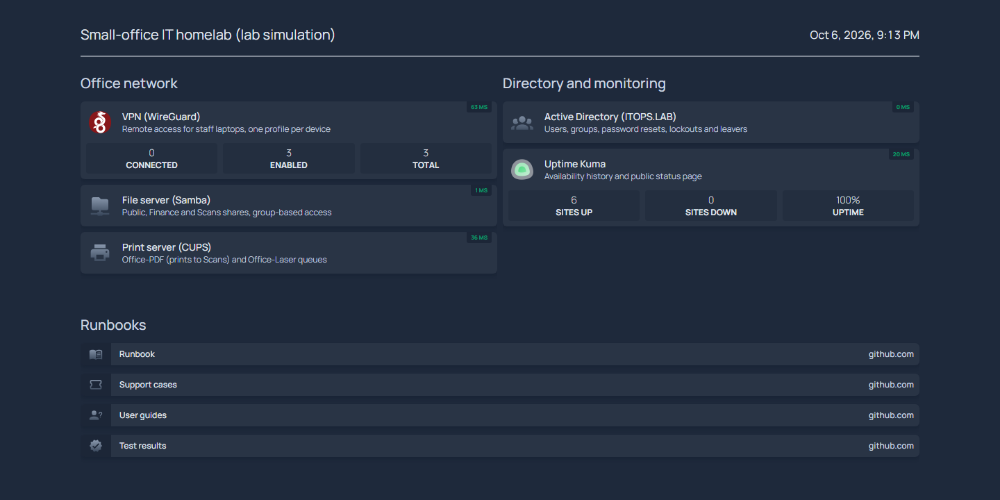
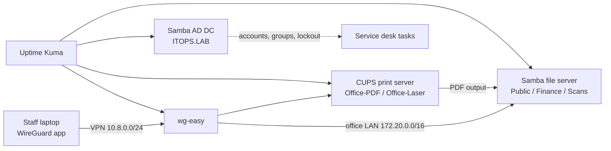
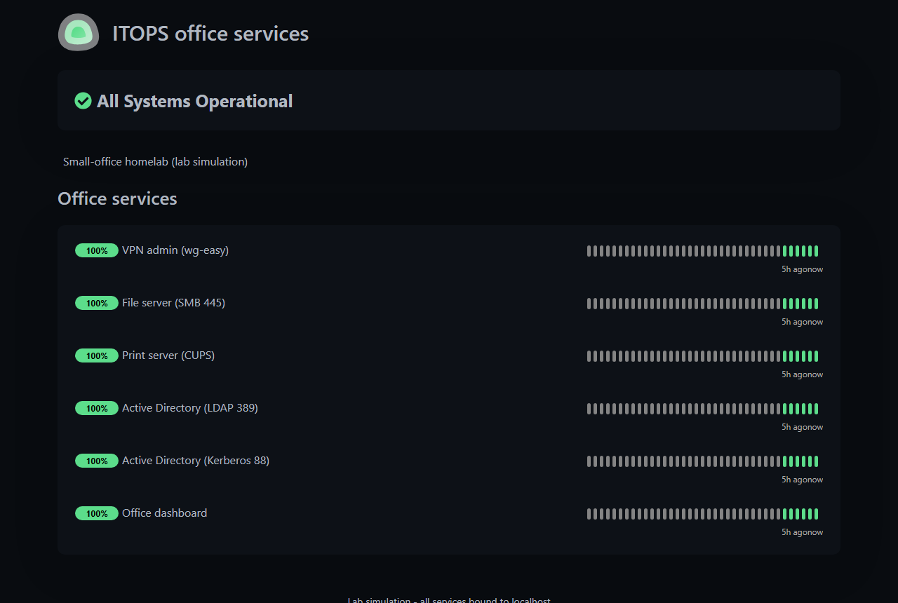
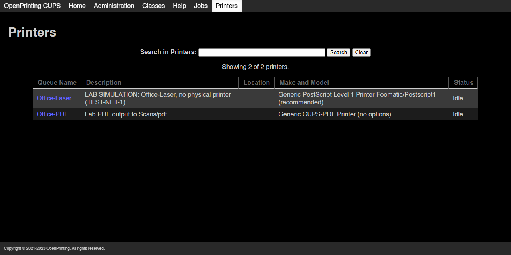

# IT Support Homelab: VPN, file server, print server and Active Directory

A small-office IT environment I built and support end to end, running in Docker on one Windows PC. It has three labs that
work together the way a real office does (staff connect over the **VPN**, open the **file shares**, and print to the **print
server** that drops PDFs into the Scans share), plus a **directory server** for account administration, **monitoring**, and an
**office dashboard** that shows the whole office on one page.

Every service is tested by scripts, and I broke and fixed three realistic faults on purpose, documented as service desk tickets.

> **Lab, not production.** All ports bind to 127.0.0.1, users are fictional, and the limits are listed at the bottom.



## Start here (2 minutes)

| If you want to see… | Open |
|---|---|
| How I troubleshoot a ticket | [VPN connects but shares won't open](docs/cases/01-vpn-shares.md), [new Finance starter gets "Access denied"](docs/cases/02-finance-starter.md), [whole office can't print](docs/cases/03-office-printing.md) |
| How I'd hand the environment to another engineer | [Runbook](docs/homelab-runbook.md): onboarding, offboarding, lost device, restore a file, clear a stuck queue, monitoring, backups |
| What end users are told | [User guides](docs/user-guides/): VPN, file shares, printing, password and MFA, Wi-Fi, email, onboarding |
| Proof it works | [Test results](docs/homelab-results.md) and redacted [transcripts](docs/evidence/) |

## The labs

| Lab | Built with | What I configured and tested |
|---|---|---|
| **VPN lab** | WireGuard (wg-easy) | Create, list and revoke per-device peers through the admin API; split-tunnel routes to the office LAN (172.20.0.0/16); a real WireGuard client container connects and reaches the file server through the tunnel |
| **File server & storage** | Samba | Public, Finance and Scans shares with group-based permissions: Finance staff can write to Finance, other staff are denied, everyone can use Public; Scans receives print-to-PDF output |
| **Print server** | CUPS | Two queues (Office-PDF prints real PDFs into Scans, Office-Laser simulates a network laser), public queue views, password-protected admin, test pages verified to complete |
| **Directory** | Samba 4 AD DC, domain `ITOPS.LAB` | OUs, users and groups; create user, reset password with change at next logon, account lockout after bad passwords and unlock, add to a group, disable a leaver |
| **Monitoring** | Uptime Kuma | Six monitors (VPN admin, SMB 445, CUPS, LDAP 389, Kerberos 88, dashboard) and a status page, created by a setup script |
| **Office dashboard** | Homepage | One page with live up/down status, VPN device count, uptime summary and links to every admin console and runbook |



## Dashboards

| Page | Local URL | What it shows |
|---|---|---|
| Office dashboard | http://127.0.0.1:13002 | Every service at a glance (screenshot above) |
| Status page | http://127.0.0.1:13001/status/office | Uptime history for each service |
| VPN admin | http://127.0.0.1:51821 | Devices, profiles and QR codes; create or revoke a device |
| Print server | http://127.0.0.1:6631/printers/ | Queues, jobs and printer administration |

 

## Worked support cases

Each fault was injected for real, diagnosed with real commands and fixed. The case write-ups are generated from the
captured output (`tests/reproduce_cases.py`):

1. **VPN connects but shares won't open.** The tunnel was up, but the saved profile was missing the office route. Proved it with `ip route get` and an `smbclient` failure, then corrected AllowedIPs and verified the route through `wg0`.
2. **New Finance starter: "Access denied".** Public worked but Finance was denied. Compared the user's groups with the share's permissions, added them to the finance group after (simulated) manager approval without widening the share, and confirmed write, read-back and delete.
3. **Whole office can't print.** Both queues were left paused after maintenance. Found it with `lpstat`, re-enabled the queues and accepted jobs, and confirmed the original stuck job completed.

## Run it

Requires Docker Desktop and Windows PowerShell 5.1 (Python 3 for the case reproductions).

```powershell
copy .env.example .env
powershell -NoProfile -File homelab/bootstrap.ps1     # generates all lab passwords privately
docker compose up -d --build
docker compose exec -T -e KUMA_PASSWORD=<KUMA_ADMIN_PASSWORD from .env> uptime node /lab/setup-kuma.js   # monitors + status page
python homelab/vpn/demo-peers.py                     # optional: three demo device profiles
powershell -NoProfile -File tests/homelab_check.ps1   # shares, permissions, printing, VPN peers, monitors, dashboard
powershell -NoProfile -File tests/ad_tasks.ps1        # directory service desk tasks
docker build -t it-support-homelab-vpn-client:14 homelab/vpn
python tests/reproduce_cases.py                       # breaks and fixes the three faults, then cleans up
```

Latest run (6 October 2026): homelab checks **0 failures**, AD tasks **0 failures**, all three cases reproduced, fixed and cleaned up.

## Honest limits

- The directory is **Samba AD**, not Windows Server: no RSAT, Group Policy or Windows domain join is demonstrated, and the file server's accounts are separate from AD.
- Office-Laser is a simulated printer. Office-PDF produces real PDFs.
- The VPN is tested with a real WireGuard client inside Docker. There's no public endpoint, MFA or production deployment.
- Backups and shadow copies are documented in the runbook as procedures, not scheduled jobs.

## Related project

[IT Ops Lab](https://github.com/iamnajib71/it-ops-lab) is an AI service-desk copilot (n8n, hybrid RAG, rule-based approval gate)
that answers tickets about this same office using the same user guides.

Built by Nazmul Hassan: [LinkedIn](https://www.linkedin.com/in/iamnajib71) · [GitHub](https://github.com/iamnajib71)
