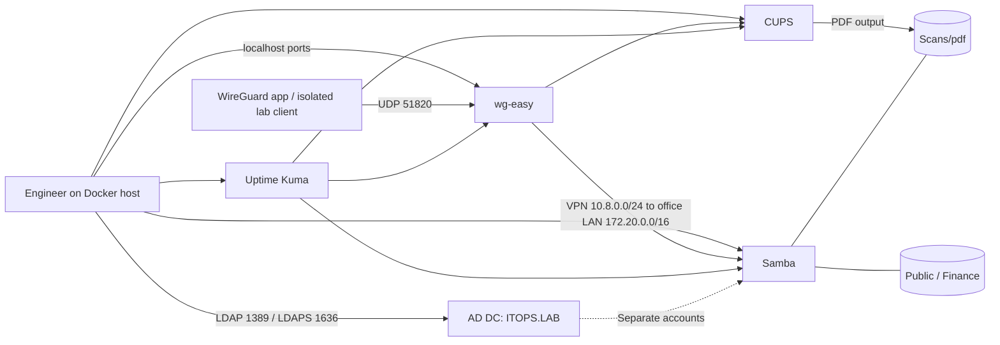

# Small-office homelab runbook

**Lab simulation; verified 6 October 2026.** Work from the project root:

```powershell
# First setup: copy .env.example to .env; bootstrap generates every lab credential privately.
powershell -NoProfile -File homelab/bootstrap.ps1
docker compose up -d --build
powershell -NoProfile -File tests/homelab_check.ps1
powershell -NoProfile -File tests/ad_tasks.ps1
# Optional: reproduce the three faults without host packages.
docker build -t it-support-homelab-vpn-client:14 homelab/vpn
python tests/reproduce_cases.py
```

Checks exit nonzero on failure and save redacted [transcripts](evidence/).
The [worked cases](cases/) contain actual injected faults and verified recovery.

## Network and services



| Service / purpose | Host → container | Administration |
|---|---|---|
| WireGuard / VPN | UDP 51820 → 51820; TCP 51821 → 51821 | http://127.0.0.1:51821; `WG_ADMIN_PASSWORD` |
| Samba / staff files | TCP 1445 → 445 | `docker compose exec fileserver sh`; Public/Scans: staff and finance; Finance: `@finance` |
| CUPS / printing | TCP 6631 → 631 | http://127.0.0.1:6631; `print` / `CUPS_ADMIN_PASSWORD` |
| Uptime Kuma / availability | TCP 13001 → 3001 | http://127.0.0.1:13001; create a local admin on first setup |
| Samba 4 AD / directory | TCP 1389 → 389; 1636 → 636 | `docker compose exec directory samba-tool`; Administrator / `AD_ADMIN_PASSWORD` |

All new host ports bind **127.0.0.1**. No internet forwarding or firewall changes.
CUPS permits private LAN/Docker ranges
inside the container; /admin requires print (trusted root CLI is also allowed).

Office-PDF uses **real cups-pdf**, saving into **Scans/pdf**; startup falls back to
`file:/dev/null` only if cups-pdf is unavailable and labels that discard simulation.
Office-Laser is a **simulated device** at `ipp://192.0.2.10/ipp/print` with a generic
PostScript driver. A nonexistent endpoint cannot advertise IPP Everywhere capabilities.
For a real printer set its URI and `-m everywhere`. PDF is default.

Use `\\fileserver\Public`, Finance and Scans from lab clients. Windows Explorer
cannot specify SMB port 1445; host checks run smbclient in Docker. VPN clients need
the intranet server IP or configured DNS; Docker service names are not client DNS.
The office LAN subnet is pinned to 172.20.0.0/16 (network `office-lan`) in docker-compose.yml,
so VPN profiles stay valid when containers are recreated. If you change it, update WG_ALLOWED_IPS and reissue profiles.
This lab has no external VPN endpoint; evidence uses a real isolated Docker peer.

## Starter, leaver, lost device

Require manager-approved access. Append a private SMB_DAVE_PASSWORD to .env and add
a persistent fileserver command entry (use an unused stable UID):

```yaml
-u "dave;${SMB_DAVE_PASSWORD};1003;staff;1101"
```

For approved Finance access use primary group `finance;1100` instead of staff.
Run `docker compose up -d fileserver` and test as the starter. Runtime
adduser/addgroup/smbpasswd changes disappear on recreation; permanent changes
must be recorded in Compose/.env.

AD is separate; GG-Finance alone does not grant the standalone share. Create AD
users with `samba-tool user create dave --userou=OU=Staff` (interactive password),
then `samba-tool group addmembers GG-Staff dave` and approved GG-Finance membership.
Seed creates OUs Staff/Finance/IT, alice/bob/carol, and GG-Staff/GG-Finance/GG-IT-Admins.
Alice is Finance; carol is IT. GG-IT-Admins is a role group, not Domain Admins.
Policy: complexity, minimum 12 characters, history 12, expiry 90 days, five failures
lock the account for 15 minutes. Rerunning seed preserves existing passwords.

Create a named VPN peer per device; deliver its private profile securely for
import in the **WireGuard app**. Verify handshake and Public access.
For leavers: disable AD (`samba-tool user disable dave`), remove the Samba Compose
entry and recreate fileserver to end sessions, revoke all VPN peers, remove obsolete
.env credentials and collect devices. AD disable alone does not revoke Samba.

A lost device is **P1**: delete that device's peer in wg-easy immediately, confirm
it is absent, investigate compromise and record the action. Create a fresh peer
for a replacement; never reuse the lost private key.

## File restore and print recovery

Obtain the full share path, approximate time, owner approval and backup date.
Extract the selected file from that volume's archive to staging; compare, copy
under a temporary name and have the user verify before replacing the current file.
Keep the current copy for rollback. Samba's .deleted folder can help with deletion,
but is not backup. The KB describes nightly shadow copies and 14-day retention;
**this lab does not implement VSS/scheduled snapshots**. Restore only from actual backups.

```powershell
docker compose exec printserver lpstat -p -o
docker compose exec printserver cancel Office-PDF-JOBNUMBER
docker compose exec printserver cupsenable Office-PDF
docker compose exec printserver cupsaccept Office-PDF
```

Inspect the disable reason and /var/log/cups/error_log. Cancel only a confirmed
blocking job; avoid an office-wide purge. Submit a page and verify IPP job-state
9 (completed), as the check does. Several affected staff means **P2**: investigate
the server. Office-Laser cannot physically print in this simulation.

## Uptime monitors, backup, security

In Kuma choose **Add New Monitor**, HTTP(s) or TCP Port, 60-second intervals and
three retries; save and confirm UP. Configure notifications only to an approved destination.

| Required host monitor | Target from inside Kuma |
|---|---|
| AD DC :1389 | TCP directory:389 |
| Samba :1445 | TCP fileserver:445 |
| CUPS :6631 | HTTP http://printserver:631/printers |
| wg-easy :51821 | HTTP http://wireguard:51821 |

localhost inside Kuma is Kuma itself. Availability is not an end-to-end permission
or printing test; retain the check scripts.

For consistent backup stop only homelab services, archive named volumes
smb_public/finance/scans, wg_data, kuma_data, cups_spool/cache and ad_data/config
with a temporary Docker tar container, preserving ownership/modes, then restart
and run checks. Keep Compose/configs and .env in separate encrypted storage.
Retain 14 daily versions off-host; test selective file and isolated AD restores monthly.
This is the backup approach, not an installed host schedule. Peer keys, AD
databases and spool data are sensitive. Do not commit archives or run down -v
for routine recovery.

Least privilege: authenticated staff groups, admin-only configuration, personal
peer keys; .env stays out of Git. Restrict Docker access because metadata contains
credentials. Use trusted TLS for deployment; the local AD test alone bypasses
trust for its self-signed LDAPS certificate. SYSVOL uses a persistent xattr TDB
backend without extra capabilities. Evidence covers Samba AD, not Windows Server,
domain join, RSAT, MFA, production hardening or physical printing.

References: [CUPS access rules](https://www.cups.org/doc/man-cupsd.conf.html),
[Samba administration](https://www.samba.org/samba/docs/current/man-html/samba-tool.8.html),
[wg-easy v14 API](https://github.com/wg-easy/wg-easy/blob/v14/src/lib/Server.js).
